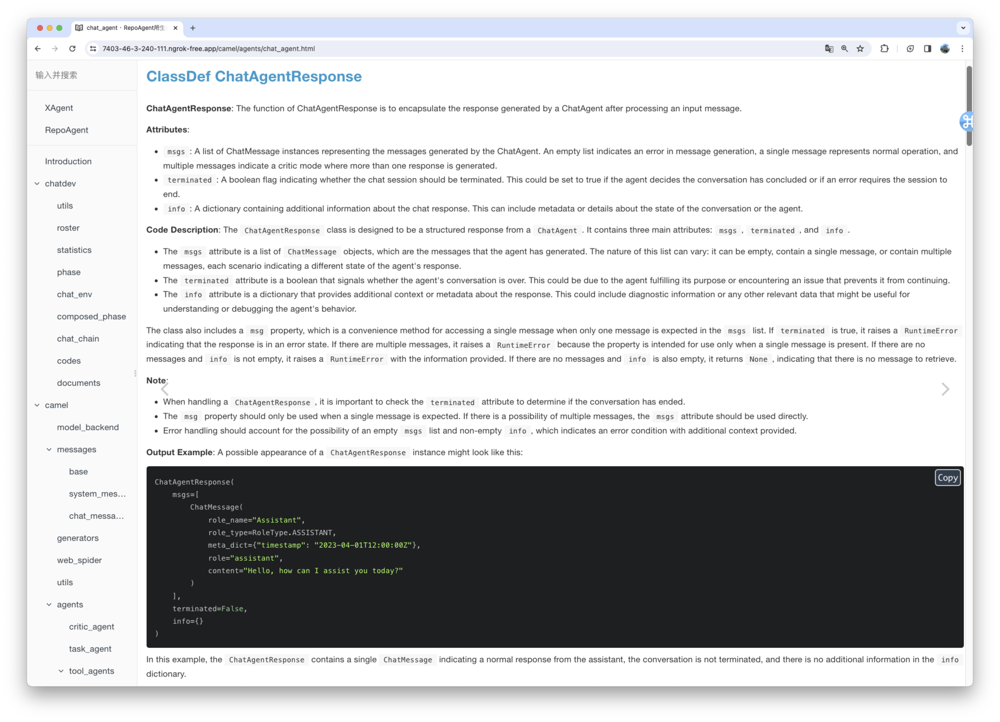

[英文](README.md) | [背景](#-背景) ｜ [特性](#-特性) ｜ [快速开始](#-快速开始) | [未来工作](#-未来工作) | [支持语言](#-支持语言) | [引用我们](#-引用我们)

# 🤗 介绍

RepoAgent是一个由大型语言模型（LLMs）驱动的开源项目，旨在提供智能化的项目文档编写方式。
它的设计目标是成为开发人员的便捷工具，用于创建、维护清晰易懂的代码文档并在团队成员之间应用协作。


# 👾 背景
在计算机编程领域，全面的项目文档非常重要，包括对每个Python文件的详细解释。这样的文档是理解、维护和增强代码库的基石。它为代码提供了必要的上下文解读，使当前和未来的开发人员更容易理解软件的目的、功能和结构。它不仅有助于当前和未来的开发人员理解项目的目的和结构，还确保项目随着时间的推移保持可访问和可修改，极大地降低了新团队成员的学习曲线。

传统上，创建和维护软件文档需要大量的人力和专业知识，这对于没有专门人员的小团队来说是一个挑战。大型语言模型（LLMs）如GPT的引入改变了这一情况，使得AI能够处理大部分文档编写过程。这种转变使得人类开发人员可以专注于验证和微调修改，极大地减轻了文档编写的人工负担。

**🏆 我们的目标是创建一个智能的文档助手，帮助人类阅读并理解repo项目，并生成文档，最终帮助人类提高效率、节省时间。**

# 🪭 特性

- **🤖 自动检测Git仓库中的变更，跟踪文件的添加、删除和修改。**
- **📝 通过AST独立分析代码结构，为各个对象生成文档。**
- **🔍 精准识别对象间调用关系，丰富文档内容的全局视野**
- **📚 根据变更无缝替换Markdown内容，保持文档的一致性。**
- **🕙 执行多线程并发操作，提高文档生成的效率。**
- **👭 为团队协作提供可持续、自动化的文档更新方法。**

# 📦 安装
首先，确保您的机器安装了python3.9以上的版本
```
$ python --version
python 3.11.4
```

接着，克隆本项目，创建一个虚拟环境，并在环境内安装依赖
```
cd RepoAgent
conda create -n RepoAgent python=3.11.4
conda activate RepoAgent
pip install -r requirements.txt
```

# 📖 快速开始
## 配置RepoAgent
在`config.yml`文件中，配置OpenAI API的相关参数信息、如目标仓库的路径、文档语言等。
```yaml
api_keys:
  gpt-3.5-turbo-16k:
    - api_key: sk-XXXX
      base_url: https://example.com/v1/
      api_type: azure
      api_version: XXX
      engine: GPT-35-Turbo-16k
      # you can use any kwargs supported by openai.ChatCompletion here
    - api_key: sk-xxxxx
      organization: org-xxxxxx
      model: gpt-3.5-turbo-16k
  ...

default_completion_kwargs:
  model: gpt-4
  temperature: 0.2
  request_timeout: 60

repo_path: /path/to/your/repo
project_hierarchy: .project_hierarchy # 全局结构信息文件夹的路径
Markdown_Docs_folder: Markdown_Docs # 目标存储库根目录中用于存储文档的文件夹
ignore_list: ["ignore_file1.py", "ignore_file2.py", "ignore_directory"] # 通过在ignore_list中给出相对路径来忽略一些您不想为其生成文档的py文件或文件夹

language: zh # 双字母语言代码（ISO 639-1 代码），例如 `language: en` 表示英语，有关更多语言，请参阅支持的语言
```

## 运行RepoAgent
进入RepoAgent根目录，在命令行输入以下命令：
```
python repo_agent/runner.py
```
如果您是第一次对目标仓库生成文档，此时RepoAgent会自动生成一个维护全局结构信息的json文件，并在目标仓库根目录下创建一个名为Markdown_Docs的文件夹，用于存放文档。
全局结构信息json文件和文档文件夹的路径都可以在`config.yml`中进行配置。

当您首次完成对目标仓库生成全局文档后，或您clone下来的项目已经包含了全局文档信息后，就可以通过**pre-commit**配置目标仓库**hook**和团队一起无缝自动维护一个项目内部文档了！

## 配置目标仓库

RepoAgent目前支持对项目的文档生成和自动维护，因此需要对目标仓库进行一定的配置。

首先，确保目标仓库是一个git仓库，且已经初始化。
```
git init
```
在目标仓库中安装pre-commit，用于检测git仓库中的变更。
```
pip install pre-commit
```
在目标仓库根目录下，创建一个名为`.pre-commit-config.yaml`的文件，示例如下：
```
repos:
  - repo: local
    hooks:
    - id: repo-agent
      name: RepoAgent
      entry: python path/to/your/repo_agent/runner.py
      language: system
      # 可以指定钩子触发的文件类型，但是目前只支持python
      types: [python]
```
具体hooks的配置方法请参考[pre-commit](https://pre-commit.com/#plugins)。
配置好yaml文件后，执行以下命令，安装钩子。
```
pre-commit install
```
这样，每次git commit时，都会触发RepoAgent的钩子，自动检测目标仓库中的变更，并生成对应的文档。
接着，可以对目标仓库进行一些修改，例如在目标仓库中添加一个新的文件，或者修改一个已有的文件。
您只需要正常执行git的工作流程: git add, git commit -m "your commit message", git push
RepoAgent hook会在git commit时自动触发，检测前一步您git add的文件，并生成对应的文档。

执行后，RepoAgent会自动更改目标仓库中的已暂存文件并正式提交commit，执行完毕后会显示绿色的Passed，如下图所示：


生成的文档将存放在目标仓库根目录下的指定文件夹中，生成的文档效果如下图所示：


我们使用默认模型**gpt-3.5-turbo**对一个约**27万行**的中大型项目[**XAgent**](https://github.com/OpenBMB/XAgent)生成了文档。您可以前往XAgent项目的Markdown_Docs文件目录下查看生成效果。如果您希望得到更好的文档效果，我们建议您使用更先进的模型，如**gpt-4**或**gpt-4-1106-preview**。

**最后，您可以通过自定义Prompt来灵活调整文档的输出格式、模板等方面的效果。 我们很高兴您探索更科学的自动化Technical Writing Prompts并对社区作出贡献。**

# ✅ 未来工作

- [x] 对象间父子关系层级结构识别及维护
- [x] 实现 Black commit
- [x] **Bi-direct reference** 构建双向引用拓扑结构
- [x] **与仓库对话(chat with repo)** 通过直接提供相关代码文件、代码块和文档信息使用户能直接向Repo提问
- [ ] 通过全局文档信息自动生成仓库README.md文件
- [ ] **多编程语言支持** 支持更多编程语言，如Java、C或C++等
- [ ] 本地模型支持如 Llama、chatGLM、Qianwen 等
- [x] 自动生成Gitbook等更佳的可视化效果

# 🇺🇳 支持语言
在`config.yml`配置文件中使用两个字母的语言代码（ISO 639-1代码）设置生成文档的目标语言，点击下方的'语言列表'部分以展开支持的语言列表。

<details>
<summary>语言列表</summary>

| 国旗 | 语言代码 | 语言   |
|------|------|------------|
| 🇬🇧 | en   | English    |
| 🇪🇸 | es   | Spanish    |
| 🇫🇷 | fr   | French     |
| 🇩🇪 | de   | German     |
| 🇨🇳 | zh   | Chinese    |
| 🇯🇵 | ja   | Japanese   |
| 🇷🇺 | ru   | Russian    |
| 🇮🇹 | it   | Italian    |
| 🇰🇷 | ko   | Korean     |
| 🇳🇱 | nl   | Dutch      |
| 🇵🇹 | pt   | Portuguese |
| 🇸🇦 | ar   | Arabic     |
| 🇹🇷 | tr   | Turkish    |
| 🇸🇪 | sv   | Swedish    |
| 🇩🇰 | da   | Danish     |
| 🇫🇮 | fi   | Finnish    |
| 🇳🇴 | no   | Norwegian  |
| 🇵🇱 | pl   | Polish     |
| 🇨🇿 | cs   | Czech      |
| 🇭🇺 | hu   | Hungarian  |
| 🇬🇷 | el   | Greek      |
| 🇮🇱 | he   | Hebrew     |
| 🇹🇭 | th   | Thai       |
| 🇮🇳 | hi   | Hindi      |
| 🇧🇩 | bn   | Bengali    |

</details>

> 例如，`language: en`代表生成的文档使用英语。

# 📊 引用我们
```bibtex
@misc{RepoAgent,
  author = {Qinyu Luo, Yining Ye, Shihao Liang, Arno},
  title = {RepoAgent: A LLM-based Intelligent tool for repository understanding and documentation writing},
  year = {2023},
  publisher = {GitHub},
  journal = {GitHub repository},
  howpublished = {\url{https://github.com/LOGIC-10/RepoAgent}},
}
```

